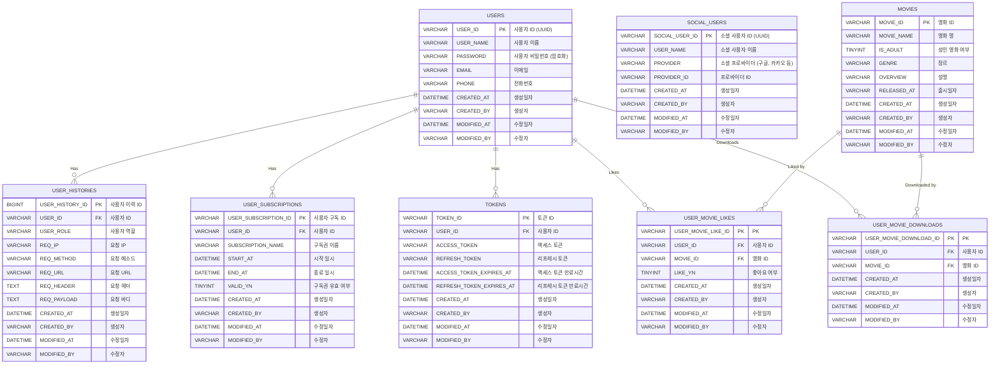

# Netflix 구독형 멤버십 프로젝트로 배우는 Spring Security

## 개요

- 이 프로젝트는 구독형 멤버십 서비스를 구현하기 위해 Spring Boot 기반의 애플리케이션을 만듭니다.
- 보안에 초점을 맞추어 Spring Security 를 활용하고, 인증과 인가 기능을 구현합니다. 
- 기본적인 로그인/로그아웃 기능과 더불어 소셜 로그인을 포함합니다.

## 주요 기술 스택

- SpringBoot 3.3.3
- Java 17
- SpringSecurity 6.x
- SpringBatch 5.x
- JWT (JSON Web Token)
- OAuth 2.0 (카카오 소셜 로그인)
- Gradle 빌드
- MySQL
- Flyway
- Docker
- React 18
- Node 20.9.0

## 프로젝트 설정

### 사전 준비

1. Java 17 또는 그 이상의 버전을 설치합니다.
2. Node 20.9.0 버전을 설치합니다.
3. 로컬 개발 환경에서는 Docker 를 활용하여 MySQL, Redis 를 설치합니다.

#### 노드 설치

nvm 을 활용하여 노드를 설치할 수 있습니다.

1. NVM 설치 확인

먼저, nvm 이 설치되어 있는지 확인합니다. 터미널에 아래 명령어를 입력하여 nvm 버전을 확인합니다.

```bash
nvm --version
```

nvm 이 설치되어 있지 않다면, nvm 공식 GitHub 페이지에서 설치 방법을 참고하세요.

2. Node.js 20.9.0 버전 설치

nvm 이 설치되었다면, 아래 명령어를 입력하여 Node.js 20.9.0 버전을 설치합니다.

```bash
nvm install 20.9.0
```

이 명령어는 Node.js 20.9.0 버전을 다운로드하고 설치합니다. 설치 후 자동으로 해당 버전이 활성화됩니다.

3. 설치된 Node.js 버전 확인

설치된 Node.js 버전을 확인하려면 다음 명령어를 사용하세요.

```bash
node -v
```

v20.9.0 이 출력되면 설치가 정상적으로 완료된 것입니다.

#### Docker-compose 를 활용하여 MySQL, Redis 실행

```shell
docker-compose -f ./infra/docker-compose.yml up -d

docker ps -a
```

### 프로젝트 실행

#### 백엔드 애플리케이션 실행

`NetplixApiApplication` 을 실행합니다.

http://localhost:8080 으로 접근할 수 있습니다.

#### 프론트엔드 애플리케이션 실행

`netplix-frontend` 디렉토리로 접근하여 애플리케이션을 실행합니다.

```shell
cd ./netplix-frontend

npm run start
```

`http://localhost:3000` 으로 접근합니다.

## 프로젝트 모듈 구조

헥사고날 아키텍쳐로 구성하기 위해 프로젝트를 멀티 모듈로 구성합니다.

주요 모듈:

- `netplix-core`: 비즈니스 로직과 도메인 모델을 관리하는 기본 모듈
- `netplix-apps`: 클라이언트가 호출할 수 있는 REST API 와 배치잡을 모아둔 모듈
- `netplix-adapters`: HTTP Client, DB, Redis 등 외부 인프라와 통신하기 위한 모듈
- `netplix-commons`: 공통으로 사용되는 유틸리티를 모아둔 모듈
- `netplix-frontend`: React 기반의 프론트엔드 코드를 모아둔 모듈

```text
root
│
├── netplix-adapters/
│   ├── adapter-http # 외부와의 통신을 담당하는 모듈
│   ├── adapter-persistence # DB 와의 통신을 담당하는 모듈
│   └── adapter-redis # 레디스와의 통신을 담당하는 모듈
│
├── netplix-apps/
│   ├── app-api # REST API 를 모아둔 모듈
│   └── app-batch # 배치잡을 모아둔 모듈
│
├── netplix-commons/ # 공통 모듈
│
├── netplix-core/
│   ├── core-domain/ # 도메인 모델을 담당하는 모듈
│   ├── core-port/ # 외부와의 통신을 위한 인터페이스를 모아둔 모듈
│   ├── core-service/ # 비즈니스 로직을 구현하는 모듈
│   └── core-usecase/ # 클라이언트에서 호출할 수 있는 인터페이스를 모아둔 모듈
│
└── netplix-frontend/ # react.js 기반 프론트엔드 모듈
```

## 영화 데이터 (TMDB - The Movie Database)

영화 데이터를 가져오기 위해 TMDB 라는 곳을 활용합니다.

- 아래 링크로 접근하여 API Key 를 받습니다.
    - https://developer.themoviedb.org/reference/intro/getting-started
- 회원가입을 하고 사이트에서 애플리케이션 등록을 합니다.
    - TIP. 설명을 좀 길게 적어야 에러가 발생하지 않습니다.

## ERD (Entity-Relation Diagram)



## Rules

다음의 룰을 따릅니다.

### 💬 Commit Convention

| 작업 태그      | 설명                                                     |
|------------|--------------------------------------------------------|
| `feat`     | 새로운 기능 추가 / 일부 코드 추가 / 일부 코드 수정 (리팩토링과 구분) / 디자인 요소 수정 |
| `fix`      | 버그 수정                                                  |
| `refactor` | 코드 리팩토링                                                |
| `style`    | 코드 의미에 영향을 주지 않는 변경사항 (코드 포맷팅, 오타 수정, 변수명 변경, 에셋 추가)   |
| `chore`    | 빌드 부분 혹은 패키지 매니저 수정 사항 / 파일 이름 변경 및 위치 변경 / 파일 삭제      |
| `docs`     | 문서 추가 및 수정                                             |
| `rename`   | 패키지 혹은 폴더명, 클래스명 수정 (단독으로 시행하였을 시)                     |
| `remove`   | 패키지 혹은 폴더, 클래스를 삭제하였을 때 (단독으로 시행하였을 시)                 |